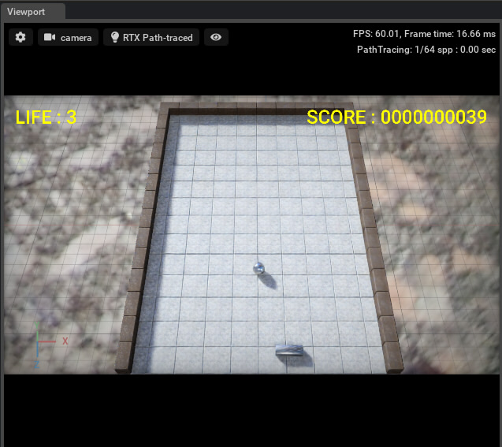
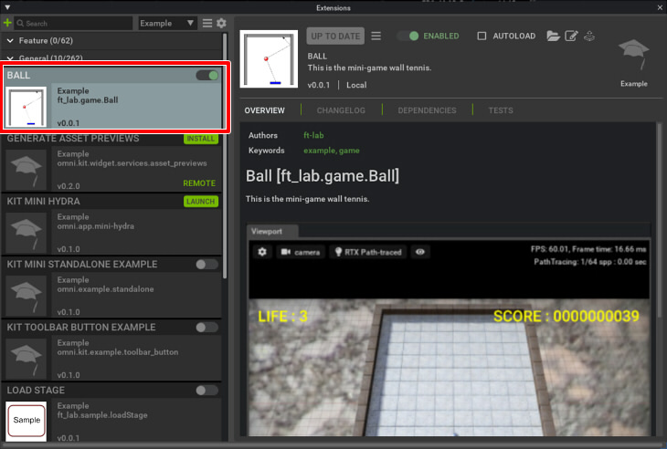
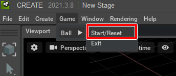
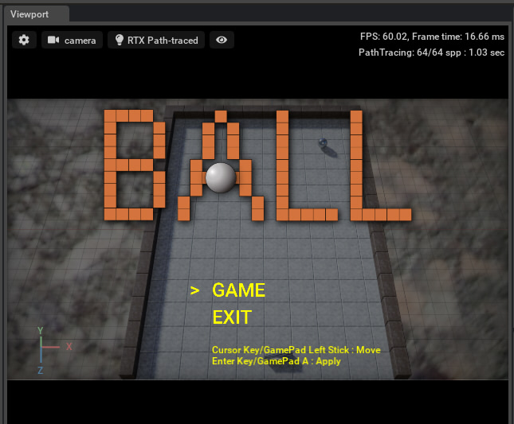

# NVIDIA OmniverseのExtensionサンプル [Ball]

## 概要

NVIDIA OmniverseのExtensionの学習のためのサンプルプロジェクトです。     
ラケットを左右に動かしてボールを打ち返すミニゲームです。     
    

Omniverse Create 2021.3.8(Omniverse Kit 102)で動作確認しました。    
※ Kit 103では現状動作しません。     

## モジュール名

ft_lab.game.Ball

## Extensionを配置

* 「[ft_lab.game.Ball](ft_lab.game.Ball)」を「Omniverseインストールフォルダ/ov/pkg/create-2021.3.8/exts」に複製します。       
* Omniverse Createを起動します。      

## はじめに確認すること

以下をあらかじめ確認するようにしてください。     

* Viewportの解像度は 1280 x 720を指定しておきます。     
* Viewport Settingsで"Fill Viewport"をOffにします。
* Viewport Settingsで"Gamepad Camera Control"をOffにします。

特に、GamePadで操作する場合は"Gamepad Camera Control"をOffにしないと、カメラ自身が動いてしまいます。     

なお、フルスクリーン表示には対応していません。     

## 遊び方

### ゲームの操作方法

ゲームを開始する流れは以下になります。      

* Extensionウィンドウで"ft_lab.game.Ball"をOnにします。    
    
* メインメニューで[Game]-[Ball]-[Start/Reset]を選択するとゲームが開始されます。      
    
なお、直前に開いていたステージはクリアされます。ファイルの保存はされません。     
* タイトル画面でキーボードの矢印キーの上下、または、GamePadのLeft Stickの上下でメニューを選択します。    
    
* [GAME] を選択して[Enter]キー、または、GamePadの[A]を押すと決定となり、ゲームが開始されます。
* ゲーム中は、キーボードの矢印キーの左右、または、GamePadのLeft Stickの左右でラケットを移動します。      
ボールを打ち返すことで得点が加算されます。     

## ゲームを終了

* メインメニューの[Game]-[Ball]-[Exit]を押すとゲームを終了します。    

## 既知の問題

* フルスクリーンにすると、オーバレイで表示しているUI(LabelやImage)が消える。
* ~~Ubuntuで動かした場合、更新イベント間隔が60fpsとかにならない ?(RTX Real-Timeにすると速すぎる)~~ 60fpsになるように回避処理を行った。

## Extensionの開発情報

Omniverseのスクリプトについては、「 https://github.com/ft-lab/omniverse_sample_scripts 」もご参照くださいませ。     

* [Extensionで使用している機能](./doc/extension_00.md)
* [ファイル構成](./doc/extension_01.md)

